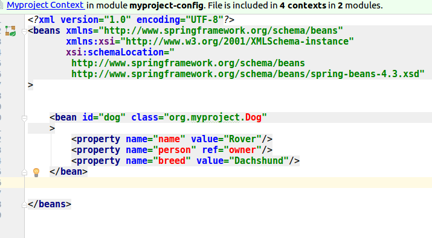
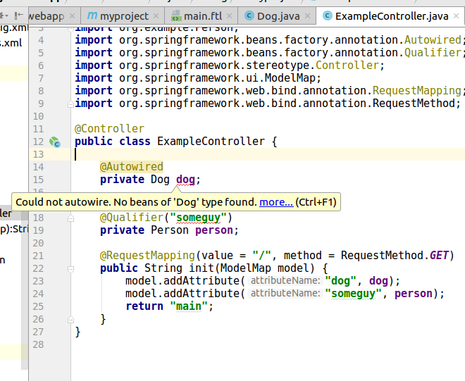

# maven-multilevel-spring-example

This project was created to illustrate issues we are having with a much larger project where we access 
Spring beans and configuration files from multiple locations in the project classpath.  

In this example, some beans and config files that are shared by the fictional organization exist in the 
organization-code and organization-config Maven projects.

The myproject Maven project contains several Maven modules:
- myproject-webapp: contains web.xml and a controller
- myproject-config: contains bean definitions in configuration files
- myproject-templates: contains Freemarker templates
- myproject-code: contains bean implementations

To run:

Import the root pom.xml non-recursively into IntelliJ.  

In the project root run:

`mvn clean install`

In the project directory myproject/myproject-webapp run: 

`mvn cargo:run`

Go to `http://localhost:9090/myproject-webapp/` to see the web page which 
contains some fields set in Spring configuration files.

## Issue

### Spring configuration across jars in the classpath.

Open `myproject/myproject-config/src/main/resources/myproject-beans.xml`.

IntelliJ cannot resolve "Dog" which is a class defined in myproject-code.  It cannot resolve "owner" which is an object defined in organization-config and organization-code.

Open `myproject/myproject-webapp/src/main/java/org/example/ExampleController.java`.

IntelliJ cannot find a bean to autowire for Dog because it is defined in another jar.

